[](https://github.com/mingjun1120/Insurance-Premium-Prediction/actions/workflows/ci.yml)
[](https://github.com/mingjun1120/Insurance-Premium-Prediction/actions/workflows/cd.yml)

# Insurance Premium Prediction

An end-to-end MLOps project that predicts annual medical insurance charges from six inputs: 
1. age
2. sex
3. BMI
4. number of children
5. smoking status
6. US region.




The project turns a notebook result into a repeatable training pipeline, a versioned model bundle, a tested API, and an Azure deployment.

## What is included

- Four notebooks for loading, exploration, model comparison, and drift.
- A configurable pipeline for five regression models.
- MLflow experiment tracking.
- DVC data and model versioning with Azure Blob Storage.
- A FastAPI prediction service.
- A multi-stage Docker serving image.
- CI and CD with GitHub Actions and Azure OIDC.
- Fast tests plus a real-data model-quality gate.

## Quick start

Run from the project root:

```bash
uv sync
uv run dvc pull
uv run pytest
uv run uvicorn app:app --reload
```

Open <http://127.0.0.1:8000/docs>, choose `POST /predict`, and use:

```json
{
  "age": 19,
  "sex": "female",
  "bmi": 27.9,
  "children": 0,
  "smoker": "yes",
  "region": "southwest"
}
```

Example response:

```json
{
  "predicted_premium": 18095.88,
  "currency": "USD",
  "model": "RandomForestRegressor"
}
```

`dvc pull` needs access to the project’s Azure storage. If you do not have it,
the [getting-started guide](docs/getting-started.md) explains the raw-data path.

## Train the model

The active model is selected in `config.yml`. The committed choice is Random
Forest.

```bash
uv run python main.py
```

This reads and cleans the data, trains and evaluates the model, saves
`models/model.pkl`, and records the run in MLflow.

```bash
uv run mlflow ui --backend-store-uri sqlite:///mlflow/mlflow.db
```

Open <http://127.0.0.1:5000> to compare runs.

## Current model result

Test-set results from notebook 03 and the production pipeline:

| Model | RMSE | MAE | R² | MAPE |
| --- | ---: | ---: | ---: | ---: |
| **Random Forest** | **$4,193** | $1,974 | 0.9043 | 0.1655 |
| XGBoost | $4,345 | $2,032 | 0.8972 | 0.1643 |
| LightGBM | $4,351 | $2,027 | 0.8970 | 0.1628 |
| CatBoost | $4,399 | $2,180 | 0.8947 | 0.1772 |
| Linear Regression | $4,942 | $2,577 | 0.8671 | 0.1806 |

The model trains on `log1p(charges)` but every metric and API result is converted
back to US dollars.

## Documentation

Read the five guides in order. Each one assumes the one before it, and every
page repeats this path at the top so you always know where you are.

| # | Read this | When you want to... |
| --- | --- | --- |
| 1 | [Getting started](docs/getting-started.md) | Install, restore files, and get one prediction. |
| 2 | [Architecture](docs/architecture.md) | See how training, prediction, and storage connect. |
| 3 | [Model development](docs/model-development.md) | Understand notebooks, cleaning, models, and results. |
| 4 | [Operations](docs/operations.md) | Run tests, DVC, MLflow, and drift checks. |
| 5 | [Deployment](docs/deployment.md) | Build the image and understand CI/CD to Azure. |
| - | [Reference](docs/reference.md) | Look up commands, config, API fields, and files. Not a step - open it any time. |

About an hour end to end. Guide 1 alone gets you a working prediction.

The architecture page includes a source-linked interactive system map, a
training-flow diagram, and a request sequence diagram.

## Temporary demo

[Open the deployed Swagger UI](https://insurance-premium-api.ambitiousgrass-8ecc70a2.malaysiawest.azurecontainerapps.io/docs).
It runs on an Azure trial expected to end around **25 September 2026**. If it is
offline, the local API works the same way.

## Important limits

- This is a learning and portfolio project, not a real pricing system.
- The dataset has only 1,338 rows.
- The public API has no authentication.
- Drift uses simulated current data and runs manually.
- Retraining and rollback are not automated.

Start with [Getting started](docs/getting-started.md).
