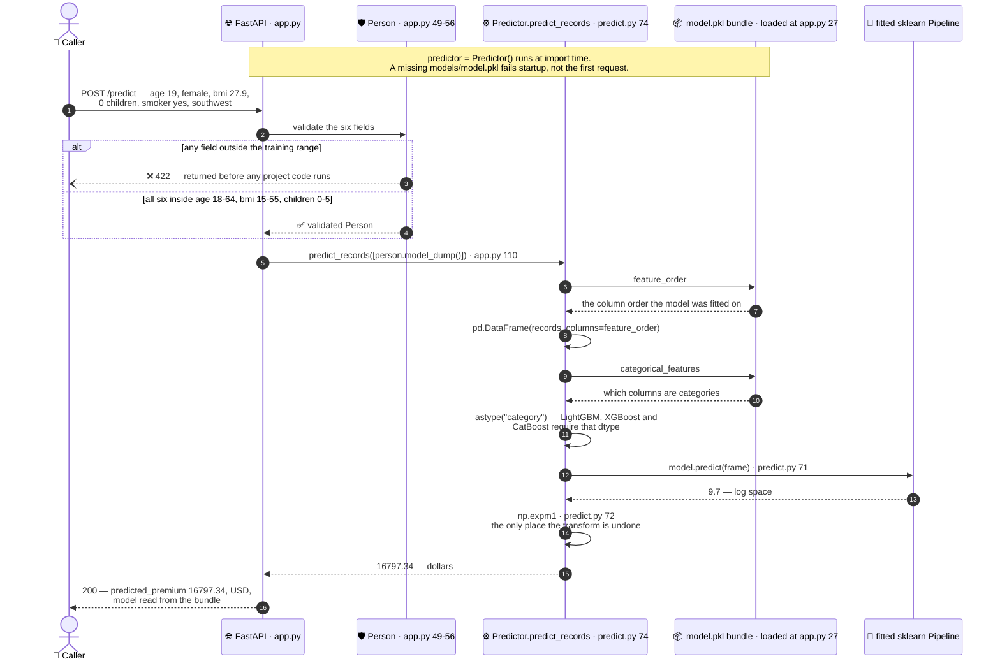
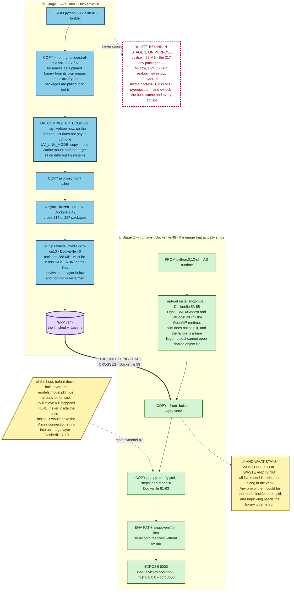

# Diagrams

Four Mermaid blocks, ready to paste. Sources: `docs/_facts.md` (gathered at
`13ed746`) and `docs/_structure-plan.md`. Every label was checked against the
file it names; none of it is generic MLOps furniture.

Mermaid rather than exported images, for two reasons: GitHub renders it natively
in Markdown, and a one-word change shows up as a one-line diff instead of a new
binary. Nothing here needs a build step.

All four parse under `@mermaid-js/mermaid-cli@11`.

**Destinations**

| # | Diagram | File | Heading it goes under |
|---|---|---|---|
| 1 | Trace A — one prediction | `docs/explanation/architecture.md` | `## Trace A — one prediction, HTTP in to dollars out` |
| 2 | Trace B — one training run | `docs/explanation/architecture.md` | `## Trace B — one training run` |
| 3 | Push to master, no secrets | `docs/explanation/deploying-without-secrets.md` | `## What happens when you push to master` |
| 4 | The two Docker stages | `docs/explanation/the-serving-image.md` | `## Two stages, and what crosses between them` |

None of those four files exists yet. They are written in Phase 4; this file is
the raw material, the same way `_facts.md` is.

---

## 1. Trace A — one prediction

**Goes in:** `docs/explanation/architecture.md`, under
`## Trace A — one prediction, HTTP in to dollars out`.

**What it shows:** one `POST /predict` from the caller to the dollar figure that
comes back, with the bundle drawn as its own participant, because `feature_order`
and `categorical_features` are read out of the artefact at request time and are
written down nowhere in `app.py`.

Three things the picture is making an argument about:

- **The 422 branch returns before any project code runs.** Validation is not a
  courtesy — `Person` (`app.py:49-56`) carries the training data's own ranges, so
  a request about a 90-year-old is refused rather than answered confidently by a
  model that has never seen one.
- **The bundle is a participant, not a decoration.** `app.py` never names a
  column. It hands over a dict; `predict_records` (`steps/predict.py:74`) rebuilds
  the frame from `feature_order` and casts the columns named in
  `categorical_features`. That is what stops the API drifting from how the model
  was fitted.
- **`np.expm1` at `steps/predict.py:72` is the only place the log transform is
  undone.** Lose that line and the endpoint returns about 9.7 for an answer of
  about $16,000, with no error and no warning.

---

## 2. Trace B — one training run

**Goes in:** `docs/explanation/architecture.md`, under
`## Trace B — one training run`.

**What it shows:** `uv run main.py` end to end — `config.yml` feeding five
separate decisions, the seven cleaning rules in notebook 02's order, the single
`log1p` on the way in, the six-key bundle on the way out, and `Predictor` reading
that bundle straight back off disk to score both splits in dollars.

```mermaid
flowchart TD
    Start(["🚀 uv run main.py"]) --> Entry["__main__ · main.py 200-203<br/>train_with_mlflow is live;<br/>main sits commented out on the line above"]
    Entry --> MLSetup["📊 MLflow pointed at an explicit SQLite path<br/>and an explicit artifact location · main.py 110-121<br/>the default URL-encodes the working directory,<br/>and this project's path holds a space and an ampersand"]
    MLSetup --> Run["♻️ run_pipeline · main.py 50<br/>shared by both entry points, so the two cannot drift"]

    Cfg[/"⚙️ config.yml — every knob, 128 lines"/]
    Cfg -.->|"data.data_path · line 9"| Ingest
    Cfg -.->|"data.target"| Cleaning
    Cfg -.->|"model.name · line 22"| Trainer
    Cfg -.->|"train.test_size 0.2 · line 14"| Split
    Cfg -.->|"train.use_log_target · lines 16-19"| Log

    Run --> Ingest["📥 Ingestion.load_data · steps/ingest.py<br/>reads data/merged_data.csv — one of the four<br/>CSVs in data/, and the only one the pipeline touches"]
    Ingest --> C1

    subgraph Cleaning["🧹 Cleaner.clean_data · steps/clean.py 43 — seven rules, in notebook 02's order"]
        direction TB
        C1["1 · convert_data_types"] --> C2["2 · handle_missing_values<br/>numerics imputed by KDE draw"]
        C2 --> C3["3 · remove_low_variance_constant_features"]
        C3 --> C4["4 · remove_outliers<br/>⚠️ logs every IQR-flagged row and removes none —<br/>they are high-cost smokers, not measurement errors"]
        C4 --> C5["5 · handle_high_cardinality_features"]
        C5 --> C6["6 · remove_highly_correlated_features"]
        C6 --> C7["7 · remove_duplicate_rows"]
    end

    C7 --> Trainer["🏗️ Trainer · steps/train.py<br/>reads model.name, looks it up in MODEL_REGISTRY,<br/>builds the Pipeline that model needs"]
    Reg[/"🗂️ MODEL_REGISTRY · train.py 39-45<br/>RandomForestRegressor → onehot<br/>LGBMRegressor · XGBRegressor · CatBoostRegressor → native<br/>LinearRegression → onehot, scaling, degree-2 terms"/]
    Reg -.-> Trainer

    Trainer --> Sep["✂️ feature_target_separator → X, y<br/>y still in dollars"]
    Sep --> Split["✂️ train_test_split_data — 80/20"]
    Split --> Log["🔁 np.log1p(y_train) · train.py 217<br/>the ONLY place the transform is applied"]
    Log --> Fit["🔥 pipeline.fit · train.py 220-222<br/>tune false fits once; tune true runs GridSearchCV,<br/>which config.yml records as roughly 44 times slower"]
    Fit --> Save["💾 save_model · train.py 257-285 → models/model.pkl"]
    Save --> BundleNode["📦 a dict of SIX keys, not a bare model<br/>model · model_name · use_log_target<br/>target · feature_order · categorical_features"]

    BundleNode --> Load["📤 Predictor loads that same bundle<br/>straight back off disk · predict.py 27-36"]
    Load --> Eval["💵 evaluate_model on both splits<br/>expm1 runs first, so RMSE, MAE, R2 and MAPE<br/>all come back in dollars"]
    Eval --> MLlog["📊 MLflow logs the params, the four metrics,<br/>the model via cloudpickle — three of the five models<br/>are not scikit-learn and the default serializer refuses them —<br/>and config.yml itself, then registers the model"]
    MLlog --> Done(["✅ results printed for both splits"])

    classDef config fill:#FFF3B0,stroke:#8A6D00,stroke-width:2px,color:#3D3000
    classDef step fill:#87CEEB,stroke:#1B3A57,stroke-width:2px,color:#0B2233
    classDef clean fill:#D4F5D4,stroke:#1F6F1F,stroke-width:2px,color:#0F3D0F
    classDef keep fill:#FFD9B3,stroke:#8A4B00,stroke-width:2px,color:#3D2000
    classDef pivot fill:#E6D6FF,stroke:#4B2E83,stroke-width:3px,color:#2A1A4A
    classDef done fill:#90EE90,stroke:#1F6F1F,stroke-width:2px,color:#0F3D0F

    class Cfg,Reg config
    class Entry,MLSetup,Run,Ingest,Trainer,Sep,Split,Fit,Save,Load,Eval,MLlog step
    class C1,C2,C3,C5,C6,C7 clean
    class C4 keep
    class Log,BundleNode pivot
    class Start,Done done
```

The two purple nodes are the pair that has to be read together. `np.log1p`
(`steps/train.py:217`) is the only place the transform is applied; the bundle is
what carries the fact of it forward. The orange node is rule 4, which finds
outliers and keeps every one of them — the one step whose name promises the
opposite of what it does.

Note also that the loop closes: `Trainer.save_model` writes the artefact and
`Predictor` loads it from disk rather than being handed the in-memory model. The
numbers printed at the end therefore come from the same code path as the API, not
from a parallel one.

---

## 3. Push to master, without a stored secret

**Goes in:** `docs/explanation/deploying-without-secrets.md`, under
`## What happens when you push to master`.

**What it shows:** the whole CD run — the OIDC token exchange, both gates, the
registry and Container Apps — with the place a stored secret would normally sit
drawn explicitly as an empty, dashed red box, because the absence is the point
and an absence is invisible otherwise.

```mermaid
flowchart TD
    Push(["📤 git push to master · cd.yml 16-17<br/>nothing else starts this run"]) --> Checkout["📦 actions/checkout@v7"]
    Checkout --> Ask["🎟️ the runner asks GitHub for an OIDC token<br/>permissions: id-token: write · cd.yml 20-22"]
    Ask --> Mint[["🐙 GitHub's OIDC issuer mints a short-lived JWT,<br/>signed by GitHub, naming this repository and this branch"]]
    Mint --> Present["🔄 azure/login@v3 presents that JWT · cd.yml 44-49<br/>alongside AZURE_CLIENT_ID, AZURE_TENANT_ID and<br/>AZURE_SUBSCRIPTION_ID — three vars, all identifiers"]
    Present --> Check{"🔐 Entra ID matches the JWT against a federated<br/>credential pinned to this repo and this branch"}
    Check -->|"no match"| Deny(["❌ no token is issued, the run fails here"])
    Check -->|"match"| Token["🔑 a short-lived Azure access token<br/>that exists only for the length of this run"]

    Absent["🚫 WHERE A STORED SECRET WOULD HAVE BEEN<br/>and is not:<br/>no client secret · no service-principal password<br/>no ACR admin password · no storage connection string<br/>GitHub Secrets holds nothing for this workflow"]
    Absent -.->|"the exchange above replaces all of it"| Present

    Token --> Deps["uv sync --frozen"]
    Deps --> Pull["📥 uv run dvc pull · cd.yml 62<br/>still no credential: .dvc/config carries only account_name,<br/>so DVC falls through to DefaultAzureCredential,<br/>which picks up the az login that just happened"]
    Pull --> Gate1{"🚦 GATE 1 · uv run pytest, then pytest -m slow<br/>cd.yml 65 and 70 — RMSE recomputed against the real data<br/>before anything is built or pushed"}
    Gate1 -->|"the number moved"| Fail1(["❌ nothing is built, nothing is pushed"])
    Gate1 -->|"the number holds"| AcrLogin["🔓 az acr login --name insurancemlops · cd.yml 73<br/>the same short-lived token again — no registry password"]

    AcrLogin --> Build["🐳 docker build, tagged with the commit sha<br/>and with latest · cd.yml 79-84"]
    Build --> ACR[("📦 insurancemlops.azurecr.io/insurance-api<br/>every running revision maps to exactly one commit")]
    ACR --> Update["🚀 az containerapp update --image ...:sha · cd.yml 88-91<br/>concurrency group cd-master, cancel-in-progress false —<br/>a half-finished deploy is never cancelled"]
    Update --> CA[["☁️ Azure Container Apps<br/>insurance-premium-api in rg-insurance-mlops"]]
    CA --> Gate2{"🚦 GATE 2 · smoke test the live URL · cd.yml 95-120<br/>GET / until it returns 200, ten attempts, 15s apart;<br/>then POST /predict and require the premium<br/>to land between 1,000 and 200,000"}
    Gate2 -->|"never 200, or about 9.8 comes back —<br/>the expm1 has been lost"| Fail2(["❌ the run goes red with the image already pushed"])
    Gate2 -->|"five figures"| Green(["✅ green, premium written to the run summary"])

    classDef gh fill:#E8E3FF,stroke:#3B2E6E,stroke-width:2px,color:#241B45
    classDef entra fill:#FFF3B0,stroke:#8A6D00,stroke-width:2px,color:#3D3000
    classDef azure fill:#87CEEB,stroke:#1B3A57,stroke-width:2px,color:#0B2233
    classDef gate fill:#FFD9B3,stroke:#8A4B00,stroke-width:3px,color:#3D2000
    classDef bad fill:#FFB6C1,stroke:#8B0020,stroke-width:2px,color:#3D000A
    classDef good fill:#90EE90,stroke:#1F6F1F,stroke-width:2px,color:#0F3D0F
    classDef absent fill:#FFFFFF,stroke:#8B0020,stroke-width:3px,stroke-dasharray:6 4,color:#8B0020

    class Push,Checkout,Ask,Mint,Deps gh
    class Present,Check,Token entra
    class Pull,AcrLogin,Build,ACR,Update,CA azure
    class Gate1,Gate2 gate
    class Deny,Fail1,Fail2 bad
    class Green good
    class Absent absent
```

Read the dashed red box first. In the ordinary version of this workflow it holds
a client secret, and `dvc pull` needs a storage connection string, and
`az acr login` needs a registry password. Here it holds nothing: GitHub mints a
short-lived JWT naming this repository and this branch, Entra ID trades it only
against a federated credential pinned to both, and the resulting token covers the
registry and the Container App for the length of the run. The three `vars` at
`cd.yml:47-49` are identifiers — a client id, a tenant id, a subscription id.
None of them is a password.

`dvc pull` (`cd.yml:62`) gets there a slightly different way, and it is worth
naming: `.dvc/config` carries only `account_name`, so with no explicit credential
DVC falls through to `DefaultAzureCredential`, which finds the `az login` that
`azure/login` just performed.

The two orange gates are what make this a model pipeline rather than a deploy
script. Gate 1 (`cd.yml:65,70`) recomputes RMSE against the real data before
anything is built. Gate 2 (`cd.yml:95-120`) asks the deployed URL for a real
prediction and rejects an answer that is not in dollars — the comment on
`cd.yml:117` says why: *"log1p dollars would come back around 9.8 rather than
five figures"*.

---

## 4. The serving image

**Goes in:** `docs/explanation/the-serving-image.md`, under
`## Two stages, and what crosses between them`.

**What it shows:** both `Dockerfile` stages side by side, the single arrow that
crosses between them, and — as their own boxes — what is deliberately left in
stage 1 and what deliberately rides along that looks like waste.

The heavy arrow is the whole design: `COPY --from=builder /app/.venv`
(`Dockerfile:59`) is the only thing that crosses. uv itself is 58 MB and never
reaches the shipped image, which is the reason the build is split in two at all.

Four labels carry the details a reader would otherwise have to reverse-engineer
from the file:

1. `--no-dev` drops **217 of 257 packages** — MLflow, DVC, SHAP, seaborn,
   sweetviz, JupyterLab. None of them is used to answer a request.
2. The `nvidia-nccl-cu13` uninstall reclaims **288 MB**, and it has to be in the
   same `RUN` as the sync. In a separate `RUN` the files survive in the layer
   below and nothing is reclaimed.
3. `libgomp1` is installed because all three boosting libraries link the OpenMP
   runtime and `python:3.12-slim` does not ship it. This one is missing from the
   README, which promises three Docker decisions and lists three savings — the
   fourth is the only one whose absence produces a bare
   `libgomp.so.1: cannot open shared object file` that explains nothing.
4. `dvc pull` sits outside the build on purpose (`Dockerfile:7-10`). Running it
   inside would bake the Azure connection string into an image layer, readable by
   anyone who has the image. The consequence is drawn as the dotted arrow from the
   host: `models/model.pkl` must already exist on disk before `docker build` runs,
   because `COPY models/ ./models/` (`Dockerfile:63`) is the only way it gets in.

The green "what stays" box exists because the obvious next optimisation is wrong.
All five model libraries remain in the venv even though only one model is being
served, since any of them could be the model inside `model.pkl` and unpickling
needs the library the object came from.
