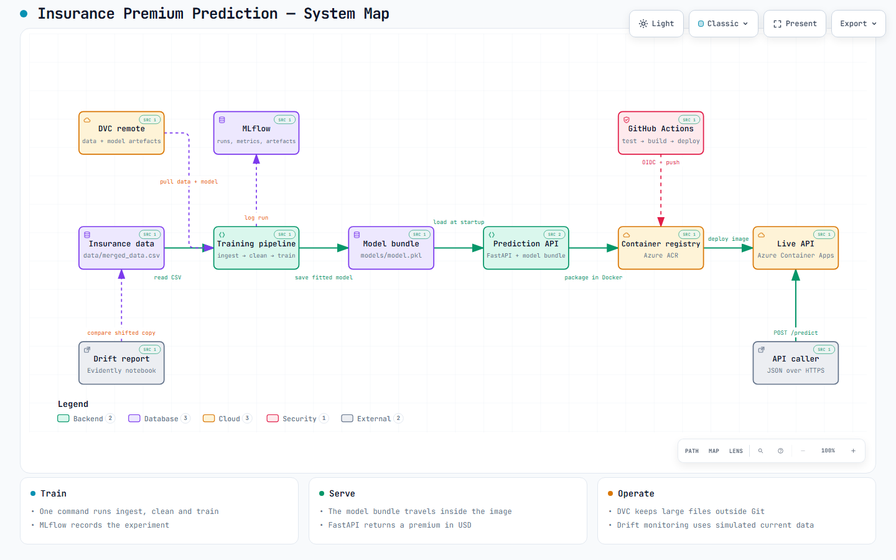
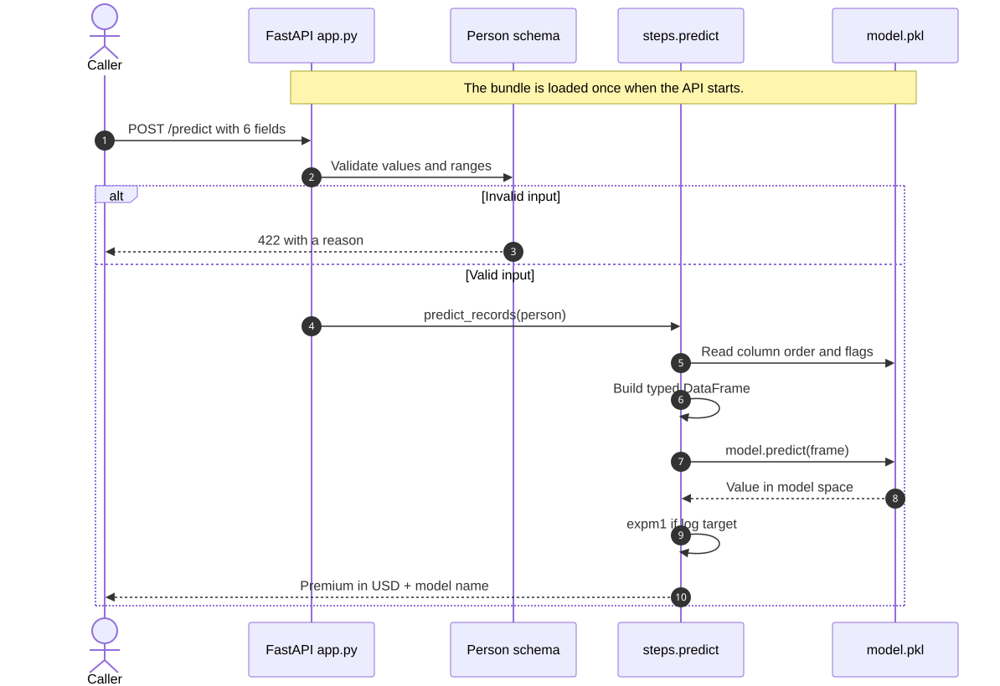

# Architecture

`Guide 2 of 5` · [Getting started](getting-started.md) → **Architecture** →
[Model development](model-development.md) → [Operations](operations.md) →
[Deployment](deployment.md)

This page explains how data becomes a prediction. The current code is the
source of truth; the project was inspired by
[`prsdm/mlops-project`](https://github.com/prsdm/mlops-project) and an earlier
loan-risk project, but it has its own training, serving, tracking, and delivery
decisions.

## System map



The large map is also available as an
[interactive HTML view](assets/architecture.html). Download or open it locally
to switch themes, search nodes, step through the four guided views, and inspect
the linked source locations.

There are three paths to remember:

- **Train:** CSV → cleaning → fitted model bundle → MLflow record.
- **Serve:** JSON → validation → shared predictor → premium in dollars.
- **Ship:** GitHub Actions → tests → Docker image → Azure Container Apps.

The arrow worth tracing twice is **Model bundle → Serving image**. `models/model.pkl`
is copied into the image at build time ([`Dockerfile`](../Dockerfile#L61)), which is
why the model has to exist on disk before `docker build`, and why the running API
reads the copy inside its own image rather than the DVC remote.

The map is the full picture. The diagram at the top of the
[README](../README.md) is a shorter version of the same system, and the two do
not match node for node on purpose: the README answers "what is this project" in
thirty seconds, this one answers "where does each piece live".

## Where the data comes from

The `00 SOURCE` zone holds the one piece of this project that is not machine
learning. [`dataset.py`](../dataset.py) reads the raw Kaggle download and writes
`data/merged_data.csv`, the single table everything downstream trains on.

It sits outside `steps/` because it is a different job. In a company, the work of
assembling that table usually belongs to a data engineering team, not to whoever
builds the model. A common shape for it is a medallion pipeline: raw records land
in a **bronze** layer, get conformed and deduplicated into **silver**, and are
curated into **gold** tables built for a particular use. The model side then takes
a gold table, combines what it needs, and produces one final dataset for analysis,
cleaning and training.

This project has no data engineering team, so `dataset.py` stands in for that
whole upstream. Today it does very little — one source, no join, so consolidation
is a pass-through (notebook 01 section 1.4.1 records why). What matters is that the
boundary is drawn and the code is on the right side of it. Everything from
[`Ingestion.load_data()`](../steps/ingest.py#L23) onwards assumes the dataset
already exists and never asks where it came from.

Notebooks are not on this path. Notebook 01 explains the business problem, the
source and the data dictionary; `dataset.py` is the executable half. That is the
same split as notebook 02 to `steps/clean.py`, and notebook 03 to `config.yml`.
The one notebook that still appears on the map is 04, because a manually-run
drift check is genuinely all the monitoring this project has.

You will not normally run `dataset.py`. `uv run dvc pull` restores
`data/merged_data.csv` along with everything else, and CI and CD use that path so
the golden test always scores the exact versioned data. `dataset.py` is for the
person who has no access to the DVC remote.

## Trace A: one training run



`main.py` owns the order. The individual steps do not call each other.

| Order | Code | Job |
| ---: | --- | --- |
| 1 | [`run_pipeline()`](../main.py#L50) | Orchestrate one complete run. |
| 2 | [`Ingestion.load_data()`](../steps/ingest.py#L23) | Read the configured CSV. |
| 3 | [`Cleaner.clean_data()`](../steps/clean.py#L43) | Apply the seven cleaning rules. |
| 4 | [`Trainer.train_model()`](../steps/train.py#L198) | Fit once or run grid search. |
| 5 | [`Trainer.save_model()`](../steps/train.py#L257) | Save the model and its context together. |
| 6 | [`Predictor.evaluate_model()`](../steps/predict.py#L104) | Report RMSE, MAE, R², and MAPE in dollars. |

Two entry points wrap that table; both call `run_pipeline()`, so neither can
drift from the other:

- [`main()`](../main.py#L89) prints the result only.
- [`train_with_mlflow()`](../main.py#L101) opens an MLflow run, lets steps 1-6
  execute inside it, then logs the parameters, metrics, model, and config.

The committed `__main__` block selects `train_with_mlflow()`.

## Trace B: one prediction request



Important details:

1. [`Predictor()`](../app.py#L27) is created when `app.py` is imported. A
   missing bundle stops startup instead of failing on the first real request.
2. [`Person`](../app.py#L30) checks all six fields before project code runs.
3. [`predict_records()`](../steps/predict.py#L74) restores the saved column
   order and categorical data types.
4. [`predict()`](../steps/predict.py#L61) applies `expm1` when the model was
   trained on `log1p(charges)`.
5. [`POST /predict`](../app.py#L90) rounds the final dollar value and returns
   the model name stored in the bundle.

This shared predictor is a safety feature. Training evaluation and the API
cannot quietly use different post-processing.

## The model file is a bundle

`models/model.pkl` is not only a fitted estimator. It stores:

```python
{
    "model": <fitted sklearn Pipeline>,
    "model_name": "RandomForestRegressor",
    "use_log_target": True,
    "target": "charges",
    "feature_order": ["age", "sex", "bmi", "children", "smoker", "region"],
    "categorical_features": ["sex", "smoker", "region"],
}
```

The model name, transform flag, and input shape travel with the model. This
reduces the chance that serving code interprets a correct prediction in the
wrong way.

## What each storage tool owns

| Tool | Stores | Why it exists |
| --- | --- | --- |
| Git | Code, config, tests, DVC pointers | Reviewable project history. |
| DVC + Azure Blob | `data/` and `models/` | Large-file versions without large Git commits. |
| MLflow + SQLite | Runs, parameters, metrics, model copy, config copy | Experiment comparison and reproducibility. |
| Azure Container Registry | Images tagged by commit SHA and `latest` | Trace a deployed image to its code. |
| Azure Container Apps | The running FastAPI container | Public HTTPS serving. |

DVC and MLflow solve different problems. DVC answers “which data and bundle go
with this Git commit?” MLflow answers “what happened during this training run?”

## What is automated today

| Area | Current state |
| --- | --- |
| Code quality | Ruff and fast tests run in CI. |
| Model quality gate | CD runs the slow real-data golden test before building. |
| Packaging | A multi-stage Dockerfile builds the serving image. |
| Deployment | A push to `master` updates Azure Container Apps. |
| Drift analysis | A notebook creates reports from simulated current data. |
| Retraining | Manual. |
| Rollback | Possible with old Container Apps revisions, but not automated. |
| API access control | Not implemented; suitable for a portfolio demo only. |

Next: [Model development](model-development.md) - the notebooks, cleaning rules,
and model comparison behind these two traces.
