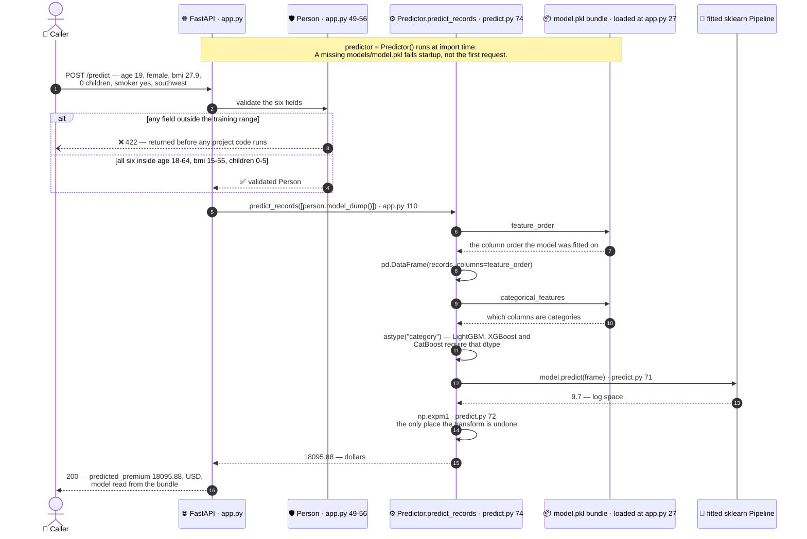

# Two traces, and the file they meet in

`app.py` is 116 lines and it decides nothing at all about the model.

It names no column. It names no model. It does not know that the number arriving
from `steps/predict.py` had a logarithm taken back out of it a moment earlier.
Read the file end to end and you cannot work out which of the five models
`config.yml:22` was last pointed at.

Everything it needs comes off a file on disk.

That arrangement is the architecture, and the quickest way to see it is to
follow one request in and one training run through. The two traces below never
call each other. They share `models/model.pkl`, and nothing else.

## Trace A — one prediction, HTTP in to dollars out



The request is a `POST /predict` carrying six fields — age 19, female, BMI 27.9,
no children, a smoker, from the southwest.

Read the diagram from the top and the first thing that happens is a refusal that
does not happen. `Person` (`app.py:49-56`) checks all six values against the
ranges the model was fitted on, and everything else in the trace runs only
because that check agreed. The branch that does not agree has its own section
below.

Past validation, `predict()` (`app.py:91`) does one thing and then gets out of
the way. It calls `person.model_dump()` to turn the validated object back into a
plain dictionary and hands that over as a one-item list (`app.py:110`).
Everything after is `steps/predict.py`.

The bundle drawn as its own participant is the point of the picture.
`predict_records` (`steps/predict.py:74`) builds a pandas DataFrame — the table
object a fitted pipeline expects — using `columns=self.feature_order`, and
`feature_order` was read out of `models/model.pkl` when the process started. The
column order is not written down in `app.py`. It is not written down twice
anywhere, so the two copies cannot disagree. The columns named in
`categorical_features` are then cast to the `category` dtype, which LightGBM,
XGBoost and CatBoost require and will not infer for themselves.

`self.predict(frame)` (`steps/predict.py:61`) calls the fitted scikit-learn
`Pipeline`, which applies whatever preprocessing that particular model needed:
one-hot encoding for the forest, nothing for the three boosters, one-hot plus
scaling plus degree-2 terms for the linear model. The API is never told which of
those happened.

Then `np.expm1` at `steps/predict.py:72`, where the number stops being a
logarithm and becomes money. That line and `steps/train.py:217` are the only two
places in `steps/` that touch the transform. Delete the one at `predict.py:72`
and the endpoint answers about 9.7 for a premium of about $16,000, with a 200
status code and valid JSON on the way out — [the-bundle.md](the-bundle.md) and
[the-log-transform.md](the-log-transform.md) are about that pair of lines and
what carries the fact of them between the two traces.

One note the diagram states rather than draws: `predictor = Predictor()` sits at
module level (`app.py:27`), so the model loads once, when the module is
imported, and not per request. A missing `models/model.pkl` therefore fails the
import. In a container that is the behaviour worth having, because a server that
started without a model would report itself healthy and fail later, on somebody
real.

## Why a valid-looking request is refused

Ask this service to price a 90-year-old and it answers `422` instead of a
number.

Every bound in `Person` comes from the training data rather than from an opinion
about what is reasonable. `age` accepts 18 to 64, which is the data's exact
range. `children` accepts 0 to 5, likewise. `bmi` is the one that was widened on
purpose: the data covers 15.96 to 53.13 and the field accepts 15 to 55, so a
value a hair outside is not refused on a technicality. `sex`, `smoker` and
`region` are `Literal` enums holding the only values that appear in the file.

The model has never seen a 90-year-old, and it would answer anyway. A fitted
regressor handed an input of the right shape always returns a float, and nothing
in the arithmetic knows that this particular input sits outside everything the
model learned from. The number would look exactly like the numbers that mean
something.

Refusing is the more honest answer, and it is also the cheap one. Validation
happens inside FastAPI, before any code in this repository runs, which is why
the 422 branch in the diagram leaves for the caller without ever reaching
`steps/`.

There is a limit worth naming, though, because the bounds are weaker than they
look. Each field is checked against its own range, one field at a time. Nothing
checks a combination. Age 18 with a BMI of 54 satisfies every bound and may
still be a person the training data has almost nothing like, and the service
will price them without hesitating. Bounds catch the input that is obviously
outside. They do not catch the input that is merely rare.

The full table, with the provenance of each bound, is
[../reference/api.md](../reference/api.md).

## Trace B — one training run

```mermaid
flowchart TD
    Start(["🚀 uv run main.py"]) --> Entry["__main__ · main.py 200-203<br/>train_with_mlflow is live;<br/>main sits commented out on the line above"]
    Entry --> MLSetup["📊 MLflow pointed at an explicit SQLite path<br/>and an explicit artifact location · main.py 110-121<br/>the default URL-encodes the working directory,<br/>and this project's path holds a space and an ampersand"]
    MLSetup --> Run["♻️ run_pipeline · main.py 50<br/>shared by both entry points, so the two cannot drift"]

    Cfg[/"⚙️ config.yml — every knob, 128 lines"/]
    Cfg -.->|"data.data_path · line 9"| Ingest
    Cfg -.->|"data.target"| Cleaning
    Cfg -.->|"model.name · line 22"| Trainer
    Cfg -.->|"train.test_size 0.2 · line 14"| Split
    Cfg -.->|"train.use_log_target · lines 16-19"| Log

    Run --> Ingest["📥 Ingestion.load_data · steps/ingest.py<br/>reads data/merged_data.csv — one of the four<br/>CSVs in data/, and the only one the pipeline touches"]
    Ingest --> C1

    subgraph Cleaning["🧹 Cleaner.clean_data · steps/clean.py 43 — seven rules, in notebook 02's order"]
        direction TB
        C1["1 · convert_data_types"] --> C2["2 · handle_missing_values<br/>numerics imputed by KDE draw"]
        C2 --> C3["3 · remove_low_variance_constant_features"]
        C3 --> C4["4 · remove_outliers<br/>⚠️ logs every IQR-flagged row and removes none —<br/>they are high-cost smokers, not measurement errors"]
        C4 --> C5["5 · handle_high_cardinality_features"]
        C5 --> C6["6 · remove_highly_correlated_features"]
        C6 --> C7["7 · remove_duplicate_rows"]
    end

    C7 --> Trainer["🏗️ Trainer · steps/train.py<br/>reads model.name, looks it up in MODEL_REGISTRY,<br/>builds the Pipeline that model needs"]
    Reg[/"🗂️ MODEL_REGISTRY · train.py 39-45<br/>RandomForestRegressor → onehot<br/>LGBMRegressor · XGBRegressor · CatBoostRegressor → native<br/>LinearRegression → onehot, scaling, degree-2 terms"/]
    Reg -.-> Trainer

    Trainer --> Sep["✂️ feature_target_separator → X, y<br/>y still in dollars"]
    Sep --> Split["✂️ train_test_split_data — 80/20"]
    Split --> Log["🔁 np.log1p(y_train) · train.py 217<br/>the ONLY place the transform is applied"]
    Log --> Fit["🔥 pipeline.fit · train.py 220-222<br/>tune false fits once; tune true runs GridSearchCV,<br/>which config.yml records as roughly 44 times slower"]
    Fit --> Save["💾 save_model · train.py 257-285 → models/model.pkl"]
    Save --> BundleNode["📦 a dict of SIX keys, not a bare model<br/>model · model_name · use_log_target<br/>target · feature_order · categorical_features"]

    BundleNode --> Load["📤 Predictor loads that same bundle<br/>straight back off disk · predict.py 27-36"]
    Load --> Eval["💵 evaluate_model on both splits<br/>expm1 runs first, so RMSE, MAE, R2 and MAPE<br/>all come back in dollars"]
    Eval --> MLlog["📊 MLflow logs the params, the four metrics,<br/>the model via cloudpickle — three of the five models<br/>are not scikit-learn and the default serializer refuses them —<br/>and config.yml itself, then registers the model"]
    MLlog --> Done(["✅ results printed for both splits"])

    classDef config fill:#FFF3B0,stroke:#8A6D00,stroke-width:2px,color:#3D3000
    classDef step fill:#87CEEB,stroke:#1B3A57,stroke-width:2px,color:#0B2233
    classDef clean fill:#D4F5D4,stroke:#1F6F1F,stroke-width:2px,color:#0F3D0F
    classDef keep fill:#FFD9B3,stroke:#8A4B00,stroke-width:2px,color:#3D2000
    classDef pivot fill:#E6D6FF,stroke:#4B2E83,stroke-width:3px,color:#2A1A4A
    classDef done fill:#90EE90,stroke:#1F6F1F,stroke-width:2px,color:#0F3D0F

    class Cfg,Reg config
    class Entry,MLSetup,Run,Ingest,Trainer,Sep,Split,Fit,Save,Load,Eval,MLlog step
    class C1,C2,C3,C5,C6,C7 clean
    class C4 keep
    class Log,BundleNode pivot
    class Start,Done done
```



Trace B follows `uv run main.py` from the entry point to a saved artefact and
back off disk again.

Start at the top, because the first node is a wart. `main.py:200-203`:

```python
if __name__ == "__main__":
    # Comment out whichever one you do not want.
    # main()
    train_with_mlflow()
```

Two entry points, selected by editing which one is commented out. It works, the
README documents it, and a command-line flag is what a reader should write
instead. It is recorded here once so that nobody copies it as a pattern.

What is underneath is better. Both entry points call `run_pipeline()`
(`main.py:50`), so the MLflow-tracked run and the plain run cannot drift apart —
there is only one of them to drift.

Then the second odd thing, and it is the reason `train_with_mlflow()` is longer
than it ought to be. MLflow — the library that records each run's parameters,
metrics and model so that runs can be compared afterwards — builds its own
tracking URI out of the working directory when it is left alone, and
URL-encodes it. This project's path contains a space and an `&`. Those become
`%20` and `%26`, SQLAlchemy then reads them back as ordinary characters instead
of decoding them, and a real folder named `Personal%20Project` appears on disk
next to the real one. The answer is at `main.py:110-121`: point MLflow at an
explicit SQLite path and an explicit artifact location, both built with
`as_posix()` and a plain `file:` prefix, because `Path.as_uri()` percent-encodes
and would bring the whole problem straight back.

None of that is a lesson about MLflow. It is a lesson about what a directory
name with a space in it can do to any library that builds URIs on your behalf.

The five dotted arrows from `config.yml` are five separate decisions taken out
of five different places in the run: the input path (line 9), the target column,
the model name (line 22), the split (line 14), and whether the target is
log-transformed (lines 15-18). One file, 128 lines, read by key at runtime.
Which is also why `tests/test_config.py` exists — nothing imports `config.yml`,
so a deleted section surfaces as a `KeyError` deep inside a training run rather
than as an error at startup. See [the-test-suite.md](the-test-suite.md).

Cleaning runs seven rules in notebook 02's order. Rule 4 is worth stopping on:
`remove_outliers` finds the outliers, logs every one, and removes none of them,
which is [keeping-the-outliers.md](keeping-the-outliers.md).

`Trainer` then reads `model.name` and looks it up in `MODEL_REGISTRY`
(`steps/train.py:39-45`). The preprocessing is derived from that name rather
than configured anywhere, and the case for doing it that way is
[preprocessing-is-not-configurable.md](preprocessing-is-not-configurable.md).
The split is 80/20 with the target still in dollars, and `np.log1p(y_train)` at
`steps/train.py:217` is the only place in `steps/` where the transform is
applied.

`save_model` (`steps/train.py:257`) writes a dictionary of six keys.

MLflow logs the parameters, the four metrics and `config.yml` itself, and it
serialises the model with `cloudpickle` rather than its own default. That is not
a preference. Three of the five registered models are not scikit-learn objects,
and the default serialiser refuses them.

## The seam

The last two nodes of Trace B are the pair to read twice.

`Trainer.save_model` writes `models/model.pkl`, and then `Predictor` loads that
same file back off disk (`steps/predict.py:31-36`) instead of being handed the
model already sitting in memory a few lines above. It looks like waste. It is
the reason the two traces can be trusted against each other.

The metrics printed at the end of a training run come out of the same class,
reading the same file, through the same `expm1`, as the number a caller gets
back from `POST /predict`. There is no second scoring path that could quietly
disagree with the first. When [../reference/results.md](../reference/results.md)
reports RMSE $4,193, that figure came out of the code the API runs.

All of which puts the weight on one file. `models/model.pkl` is not a model. It
is six keys, and the five that are not the model are what let `app.py` know
nothing. That argument is [the-bundle.md](the-bundle.md), and it is the page to
read after this one.
