# Deploying without storing a secret

The ordinary way to let GitHub deploy to Azure is to create a service principal,
copy the password it prints once, and paste that password into GitHub Secrets.
After that the deploy works. So would anyone else's, from any machine, in no
particular hurry, for as long as nobody rotates the string.

`cd.yml` keeps none of it. No client secret. No service-principal password. No
registry password for the image push, and no connection string for the storage
account the model is pulled out of. GitHub Secrets holds no entry for this
workflow at all.

Four things are missing and the deploy still runs. This page is about what stands
in for them.

## The workflow that never logs in

Only one of the two workflows needs Azure. `ci.yml` was written so that it would
not (`ci.yml:3-6`).

The test suite skips anything that requires `models/model.pkl` or `data/`. Both
are DVC-owned and git-ignored, so neither exists on a fresh runner, and the suite
treats their absence as a reason to skip rather than a reason to fail:

```
80 passed, 28 skipped, 1 deselected, 135 warnings in 3.96s
```

That is 80 of the 109 tests, on a machine with no Azure account attached to it.
Two things follow. CI stays green whether or not the subscription behind the
project is alive, so a pull request gets a check that an expired trial cannot
block. And anyone can fork the repository and get that check running without
first being handed anything.

Why the suite skips rather than fails is [the-test-suite.md](the-test-suite.md).
It matters here only as the reason the cheaper of the two workflows needs no
identity at all.

The rest of this page is about the one that does.

## A token that expires instead of a password that does not

`azure/login` is the step that gets the runner an Azure identity, and it uses
OIDC.

OIDC — OpenID Connect — takes a paragraph if you have not met it. GitHub runs a
small service that will make a signed statement about the workflow run currently
in progress: which repository it belongs to, which branch moved, which run it is.
The runner asks for that statement (`permissions: id-token: write`,
`cd.yml:20-22`) and gets back a JWT, a short JSON document with a signature
attached. Anyone can read a JWT. Only GitHub could have produced this one,
because only GitHub holds the key that signed it.

The statement is not a password, and it is not addressed to Azure in particular.
It is a claim about one run, and it stops being true almost immediately.

Microsoft Entra ID holds the other half: a federated credential, which is a rule
naming the one subject line it is willing to accept.

```
repo:mingjun1120@54136320/Insurance-Premium-Prediction@1347131480:ref:refs/heads/master
```

`azure/login` presents the JWT (`cd.yml:44-49`). Entra checks the signature, then
checks the subject against that rule. On a match it issues an Azure access token
that lives about as long as the run does. On anything else it issues nothing, and
the workflow stops there with no token to continue on.

A fork cannot match that line. Neither can a pull request, nor another branch of
this repository.

That is the whole substitution. A stored password answers the question *does the
caller know the string?*, and the honest answer is yes, for anyone who has ever
seen it, indefinitely. The exchange answers *is this a run of this branch of this
repository, happening now?* — which a copied string cannot answer later, and no
other repository can answer at all.

## What happens when you push to master

```mermaid
flowchart TD
    Push(["📤 git push to master · cd.yml 16-17<br/>nothing else starts this run"]) --> Checkout["📦 actions/checkout@v7"]
    Checkout --> Ask["🎟️ the runner asks GitHub for an OIDC token<br/>permissions: id-token: write · cd.yml 20-22"]
    Ask --> Mint[["🐙 GitHub's OIDC issuer mints a short-lived JWT,<br/>signed by GitHub, naming this repository and this branch"]]
    Mint --> Present["🔄 azure/login@v3 presents that JWT · cd.yml 44-49<br/>alongside AZURE_CLIENT_ID, AZURE_TENANT_ID and<br/>AZURE_SUBSCRIPTION_ID — three vars, all identifiers"]
    Present --> Check{"🔐 Entra ID matches the JWT against a federated<br/>credential pinned to this repo and this branch"}
    Check -->|"no match"| Deny(["❌ no token is issued, the run fails here"])
    Check -->|"match"| Token["🔑 a short-lived Azure access token<br/>that exists only for the length of this run"]

    Absent["🚫 WHERE A STORED SECRET WOULD HAVE BEEN<br/>and is not:<br/>no client secret · no service-principal password<br/>no ACR admin password · no storage connection string<br/>GitHub Secrets holds nothing for this workflow"]
    Absent -.->|"the exchange above replaces all of it"| Present

    Token --> Deps["uv sync --frozen"]
    Deps --> Pull["📥 uv run dvc pull · cd.yml 62<br/>still no credential: .dvc/config carries only account_name,<br/>so DVC falls through to DefaultAzureCredential,<br/>which picks up the az login that just happened"]
    Pull --> Gate1{"🚦 GATE 1 · uv run pytest, then pytest -m slow<br/>cd.yml 65 and 70 — RMSE recomputed against the real data<br/>before anything is built or pushed"}
    Gate1 -->|"the number moved"| Fail1(["❌ nothing is built, nothing is pushed"])
    Gate1 -->|"the number holds"| AcrLogin["🔓 az acr login --name insurancemlops · cd.yml 73<br/>the same short-lived token again — no registry password"]

    AcrLogin --> Build["🐳 docker build, tagged with the commit sha<br/>and with latest · cd.yml 79-84"]
    Build --> ACR[("📦 insurancemlops.azurecr.io/insurance-api<br/>every running revision maps to exactly one commit")]
    ACR --> Update["🚀 az containerapp update --image ...:sha · cd.yml 88-91<br/>concurrency group cd-master, cancel-in-progress false —<br/>a half-finished deploy is never cancelled"]
    Update --> CA[["☁️ Azure Container Apps<br/>insurance-premium-api in rg-insurance-mlops"]]
    CA --> Gate2{"🚦 GATE 2 · smoke test the live URL · cd.yml 95-120<br/>GET / until it returns 200, ten attempts, 15s apart;<br/>then POST /predict and require the premium<br/>to land between 1,000 and 200,000"}
    Gate2 -->|"never 200, or about 9.8 comes back —<br/>the expm1 has been lost"| Fail2(["❌ the run goes red with the image already pushed"])
    Gate2 -->|"five figures"| Green(["✅ green, premium written to the run summary"])

    classDef gh fill:#E8E3FF,stroke:#3B2E6E,stroke-width:2px,color:#241B45
    classDef entra fill:#FFF3B0,stroke:#8A6D00,stroke-width:2px,color:#3D3000
    classDef azure fill:#87CEEB,stroke:#1B3A57,stroke-width:2px,color:#0B2233
    classDef gate fill:#FFD9B3,stroke:#8A4B00,stroke-width:3px,color:#3D2000
    classDef bad fill:#FFB6C1,stroke:#8B0020,stroke-width:2px,color:#3D000A
    classDef good fill:#90EE90,stroke:#1F6F1F,stroke-width:2px,color:#0F3D0F
    classDef absent fill:#FFFFFF,stroke:#8B0020,stroke-width:3px,stroke-dasharray:6 4,color:#8B0020

    class Push,Checkout,Ask,Mint,Deps gh
    class Present,Check,Token entra
    class Pull,AcrLogin,Build,ACR,Update,CA azure
    class Gate1,Gate2 gate
    class Deny,Fail1,Fail2 bad
    class Green good
    class Absent absent
```



Read the dashed red box first, because it is drawn around nothing. In the
ordinary version of this workflow that box holds a client secret, `dvc pull`
needs a storage connection string, and `az acr login` needs a registry password.
Here one exchange covers all three, and covers them only until the run ends.

The two orange gates belong to a different argument — they are what stops a
working deploy from shipping a broken model — and they have their own page in
[deploy-gates.md](deploy-gates.md). The steps for setting any of this up on your
own subscription are in
[how-to/deploy-to-your-own-azure.md](../how-to/deploy-to-your-own-azure.md).

## Three identifiers, not three passwords

Three values do get stored in GitHub:

```
AZURE_CLIENT_ID  AZURE_TENANT_ID  AZURE_SUBSCRIPTION_ID
```

They are repository **variables** rather than repository secrets, and the label
is accurate rather than careless. A client id names an application registration.
A tenant id names a directory. A subscription id names a billing boundary. Each
one tells Azure where to look, and none of them tells Azure to allow anything.

Hand all three to a stranger and they still cannot deploy. The piece they lack is
a JWT signed by GitHub carrying that exact subject line, and there is no way to
make GitHub sign one for a repository you do not control.

## `dvc pull` gets there a different way

The runner still has to fetch `models/model.pkl` out of a private storage account
before it can run the slow tests. That is a second thing needing permission, and
it is granted by a route the token exchange does not explain on its own.

`.dvc/config` is committed. It carries a remote named `azureremote`, the URL
`azure://dvcstore`, and `account_name = insurancedvc`. It carries no credential.
The connection string lives in `.dvc/config.local`, which git ignores, so on a
runner that file does not exist at all.

Given an account name and nothing more specific, DVC hands the problem to
`DefaultAzureCredential`, a helper that tries a list of credential sources in
turn and uses the first that answers. On this runner the first that answers is
the `az login` that `azure/login` performed a few steps earlier (`cd.yml:8-11`,
`cd.yml:62`).

So the token minted for the deploy also reads the model. One exchange, two uses,
and the omission in `.dvc/config` is what allows it. For what DVC is, and why the
model lives outside git at all, see [data-outside-git.md](data-outside-git.md).

## Three narrow roles instead of Contributor

Everything above settles who the runner is. None of it says what that identity is
allowed to do, and the second question is answered separately.

Most guides answer it with `Contributor` on the resource group. That is one
assignment, it covers everything the pipeline will ever touch, and it always
works. It also means that if the identity is ever misused, everything in the
group goes with it — the registry, the storage account and the running app
together.

This project assigns four roles instead. The pipeline gets `AcrPush` on the
registry, so it can upload the image it just built. It gets
`Storage Blob Data Reader` on the storage account, so `dvc pull` can read the
model. It gets `Container Apps Contributor` on the app, so it can point the app
at the new tag. The app itself gets the fourth, `AcrPull` on the registry, so it
can read its own image at start-up.

The split between those last two carries the idea. The pipeline writes images and
the app only reads them, so they are not the same identity and they do not hold
the same role. The scopes, as a table, are in
[reference/workflows.md](../reference/workflows.md).

Set beside the short-lived token, this is the other half of one design, and the
halves do not overlap. The token limits how long a leaked credential is worth
anything. The roles limit how far it reaches while it lasts. Neither covers for
the other.

The cost is real. Four assignments instead of one, each a separate command, each
easy to skip. And skipping one does not produce a message telling you which one.
It produces the next section.

## `Owner` is not read access

`Owner` on a storage account does not let you read a blob inside it. Neither does
`Contributor`. That is not a quirk of this project's setup — it is how Azure
divides storage permissions, and it catches people who have done everything else
correctly.

Two separate families of role apply to the same account. One family governs the
account as a resource: creating it, deleting it, changing its network rules,
reading its configuration. `Owner` and `Contributor` live in that family, and
`Owner` is as far as that family reaches. The other family governs the bytes
inside the containers, and it has its own names — `Storage Blob Data Reader` is
the one this pipeline needs. Holding every role in the first family grants
nothing whatsoever in the second.

The expensive part is the shape of the failure.

`azure/login` succeeds. It reports success, the step goes green, and the identity
it obtained is genuine. Several steps later, `dvc pull` stops with a `403`.

A `403` arriving shortly after a login that worked reads as one thing: the login
did not really work. So the next hour goes into the credential. Re-check
`AZURE_CLIENT_ID`. Re-check the tenant. Delete the federated credential and
create it again. Widen the branch pattern, in case the subject line is off by a
character. Every one of those is a sensible thing to check, and not one of them
changes the outcome, because not one of them is wrong. The identity is exactly
who it claims to be, and it holds no role anywhere that mentions blobs.

The fix is a single role assignment, and no amount of staring at the token would
have suggested it.

A request refused immediately after a login that went green is usually not a
question about the login. Authentication settles who is asking. Authorisation
settles what they may do. A `403` is the second one saying no, in the one place
where the first is easier to suspect.
