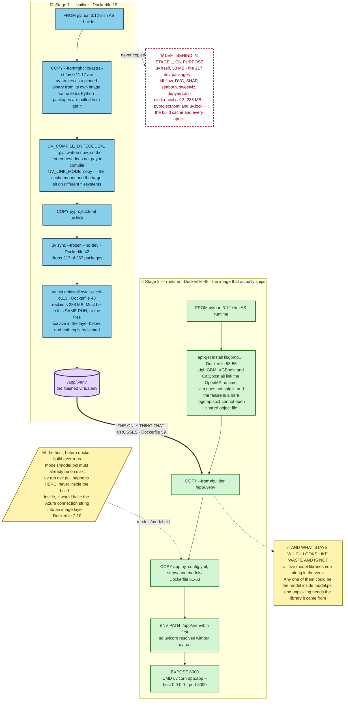

# What is in the serving image, and what is not

The development environment for this project installs 257 packages. The image
that answers HTTP requests holds 40 of them, and it comes to 1.02 GB.

Most of that gigabyte is three libraries the running container will most likely
never call. They are in there on purpose, and that decision is more interesting
than any of the cuts.

## Two stages, and what crosses between them



The heavy arrow is the reason there are two stages at all. `COPY --from=builder
/app/.venv` (`Dockerfile:59`) is the only thing that crosses. Everything the
build needed in order to produce that directory stays behind in a stage nobody
ships — uv is 58 MB of it, and it installs the packages without travelling with
them.

The runtime stage installs no Python packages of its own. It receives a finished
virtualenv, copies four paths in beside it — `app.py` and `config.yml`, `steps/`
and `models/` — puts the virtualenv first on `PATH` so `uvicorn` resolves
without `uv run` (`Dockerfile:66`), and hands over to that one command.

## The 217 packages that are not there

`uv sync --frozen --no-dev` (`Dockerfile:42`) installs the runtime dependencies
and stops, which leaves out 217 of the 257. Gone: MLflow, DVC, SHAP, seaborn,
sweetviz, JupyterLab. An endpoint that turns six fields into one number logs no
experiments, resolves no data remote, explains no predictions and draws no
charts.

`--frozen` is the other half of that line. It installs exactly what `uv.lock`
records and refuses to re-resolve, so the image is built from the versions that
were tested rather than from whatever was newest that morning.

## 288 MB, and why the uninstall shares a `RUN`

XGBoost's Linux wheel declares `nvidia-nccl-cu13` as a dependency, so installing
XGBoost drags in 288 MB of CUDA libraries. NCCL passes data between several
GPUs. This container has no GPU, and the Dockerfile records that somebody
checked instead of assuming: *"Verified: XGBoost trains and predicts normally
without it."*

So it is uninstalled. The mechanical part is where the lesson is:

```dockerfile
RUN uv sync --frozen --no-dev \
    && uv pip uninstall --python /app/.venv/bin/python nvidia-nccl-cu13
```

Both commands sit in one `RUN`, and they have to. A Docker image is a stack of
layers, one per instruction, each holding the changes that instruction made. A
later layer can mark a file as deleted. It cannot reach into the layer below and
take the bytes back, because that layer is already written and other images may
be sharing it. Split those two commands onto two `RUN` lines and the CUDA files
are installed by the first, marked gone by the second, and still downloaded in
full by everybody who pulls the image. The 288 MB is only saved while both
halves happen before the layer is sealed.

## The decision that is not about size

Three of the four decisions in this file save space. The fourth is the reason
the container starts at all, and it is the one the README leaves out.

The runtime stage installs `libgomp1` from apt before anything else
(`Dockerfile:53-55`), in a single `RUN` that updates the package lists, installs
with `--no-install-recommends`, and deletes the lists again so they do not ride
along in the layer.

LightGBM, XGBoost and CatBoost all link against the OpenMP runtime, which is how
they use more than one core. The full `python:3.12` image ships it.
`python:3.12-slim` does not, and what comes back is not a message about missing
system packages, or about OpenMP, or about which library wanted it. It is this,
raised at import:

```
libgomp.so.1: cannot open shared object file
```

A filename, and nothing else. Nothing in it says that the file belongs to the
operating system rather than to pip, which is the one fact that turns the search
around. Three lines of `apt-get` stand between that message and a container that
runs, and the README's Docker section — which promises three things and then
lists three savings — does not mention them.

## `dvc pull` stays outside the build

The last decision is at the top of the file, above every instruction
(`Dockerfile:7-10`), and it concerns a command that is not there.

`models/model.pkl` is DVC-tracked and git-ignored, so it has to be fetched
before an image can be built. The obvious place for that fetch is inside the
build, where it would happen by itself. It is left out for the same layer reason
as the CUDA uninstall, pointed the other way: a connection string used during a
build stays in the layer that used it, and anyone holding the image can read it
back out. Deleting it in a later instruction changes nothing.

So the fetch happens on the host, and `COPY models/ ./models/` (`Dockerfile:63`)
is the only route the artefact has into the image. The cost is a build that
fails on a fresh clone for a reason that has nothing to do with Docker — the
file is not there to copy. Why the model lives outside git at all is
[data-outside-git.md](data-outside-git.md).

## The 500 MB that stays on purpose

All five model libraries are still in the shipped virtualenv, and they are most
of what remains of the gigabyte. One model is ever served.

That looks like the next cut to make, and it is the one to leave alone. The
image does not know which model it is serving. `models/model.pkl` knows — the
bundle carries its own `model_name`, and `config.yml:22` can be pointed at any
of the five and retrained with no edit to `app.py` whatsoever, which is
[the-bundle.md](the-bundle.md). Unpickling a fitted object needs the library
that produced it, so an image built with scikit-learn alone serves exactly one
of the five artefacts and fails at start-up on the other four.

The README puts the saving at around 500 MB, roughly half the image, which is
not a small prize. Taking it means accepting that the image and the artefact
become a matched pair: change the model, rebuild the image, and a mismatched
bundle announces itself as a container that will not start.

For a project that has settled on one model and rebuilds on every retrain, that
is a fair trade. It is the wrong trade here, where switching models is a
one-line edit and the entire design is arranged so that the file on disk decides
and the code does not.

The cuts that were taken all removed things no request could ever reach: the dev
packages, uv itself, a CUDA runtime for a GPU that does not exist. The cut that
was refused would have removed something a request might reach, on the day
somebody edits one line of `config.yml`. That is the line this build is drawn
along, and it is not the same line as "make the image smaller".
