# Model development

`Guide 3 of 5` · [Getting started](getting-started.md) →
[Architecture](architecture.md) → **Model development** →
[Operations](operations.md) → [Deployment](deployment.md)

Use this page when you want to understand the data science, compare models, or
retrain the saved bundle.



The notebooks explain decisions. The Python pipeline repeats those decisions
in reusable code.

## Notebook map

| Notebook | Main question | Output used later |
| --- | --- | --- |
| `01_load_data.ipynb` | Can the raw data be loaded into one clean table? | The business framing and data dictionary; the code lives in `dataset.py` |
| `02_eda_and_preprocessing.ipynb` | What is in the data, and which cleaning rules are justified? | `data/cleaned_data.csv`, and rules implemented in `steps/clean.py` |
| `03_model_training.ipynb` | Which model and target treatment work best? | Winning parameters in `config.yml`, and `models/<winner>_insurance_model.pkl` |
| `04_monitoring.ipynb` | Can Evidently detect a shifted current sample? | Two HTML reports in `reports/`, and `data/production.csv` |

Run them in order. Notebook 03 reads `data/cleaned_data.csv`, which notebook 02
writes, so 03 cannot run on a fresh clone until either 02 has run or `dvc pull`
has restored the file. The training pipeline does not share that dependency: it
reads `data/merged_data.csv` and cleans it itself.

The dataset has 1,338 rows. The target is annual medical insurance `charges`.
The six input features are age, sex, BMI, number of children, smoking status,
and US region.

## Cleaning rules

`Cleaner.clean_data()` always runs these rules in this order:

```text
text → category
      ↓
fill missing values or drop mostly-empty columns
      ↓
drop constant or very low-variance features
      ↓
measure outliers, but keep the rows
      ↓
group rare values in high-cardinality categories
      ↓
drop highly correlated numeric duplicates
      ↓
remove duplicate rows
```

The target column is protected from removal and imputation rules. On the
current insurance data, several defensive rules find nothing to change. They
are present for future data, not to make today’s dataset look busier.

Outliers are kept. Expensive smokers are important examples of the problem,
not automatic errors.

## Model choices

Change one line in `config.yml`:

```yaml
model:
  name: RandomForestRegressor
```

Allowed values and their pipelines:

| Model | Preprocessing |
| --- | --- |
| `RandomForestRegressor` | One-hot encode categorical features. |
| `LGBMRegressor` | Use pandas categorical columns directly. |
| `XGBRegressor` | Use pandas categorical columns directly. |
| `CatBoostRegressor` | Pass categorical column names at fit time. |
| `LinearRegression` | One-hot encode, scale, add polynomial terms, then rescale. |

Preprocessing is chosen in `steps/train.py`, not in YAML. This keeps invalid
model/preprocessing combinations out of configuration.

## Target transform

The committed configuration uses:

```yaml
train:
  use_log_target: true
```

Training fits on `log1p(charges)`. Evaluation and serving apply `expm1` before
showing a result.

```text
training:   dollars → log1p → fit model
serving:    model output → expm1 → dollars
```

Why: the target is strongly right-skewed. Log space stops a few very expensive
customers from dominating every squared error. All reported metrics remain in
dollars.

## Current comparison

Test-set results from notebook 03, reproduced by the pipeline:

| Model | RMSE | MAE | R² | MAPE |
| --- | ---: | ---: | ---: | ---: |
| **Random Forest** | **$4,193** | $1,974 | 0.9043 | 0.1655 |
| XGBoost | $4,345 | $2,032 | 0.8972 | 0.1643 |
| LightGBM | $4,351 | $2,027 | 0.8970 | 0.1628 |
| CatBoost | $4,399 | $2,180 | 0.8947 | 0.1772 |
| Linear Regression | $4,942 | $2,577 | 0.8671 | 0.1806 |

Random Forest is the selected model because it has the lowest test RMSE here.
The table is evidence for this dataset and split, not a claim that Random
Forest is always best.

## Fit once or tune

```yaml
model:
  tune: false
```

- `false`: fit once with the saved winning parameters. This is the normal path.
- `true`: run `GridSearchCV` with five-fold cross-validation and the active
  model’s `tuning_params`. This takes much longer.

Then run:

```bash
uv run python main.py
```

The command overwrites `models/model.pkl`. If the new bundle should become a
versioned project artefact, follow the DVC steps in [operations](operations.md).

## Inspect the MLflow run

```bash
uv run mlflow ui --backend-store-uri sqlite:///mlflow/mlflow.db
```

Open <http://127.0.0.1:5000>. Each tracked run includes:

- fitted parameters;
- test RMSE, MAE, R², and MAPE;
- model name and tuning tags;
- an MLflow model copy;
- the exact `config.yml` used for the run.

Use MLflow to compare experiments. Use `models/model.pkl` for the application.

## Before accepting a new model

```bash
uv run pytest
uv run pytest -m slow
```

Check all of the following:

- the slow test still returns metrics near the recorded result;
- API predictions are in dollars, not log space;
- the bundle contains all six keys described in [the reference](reference.md);
- the chosen model library remains in the serving dependencies;
- `config.yml`, `models.dvc`, and the MLflow run tell the same story.

Next: [Operations](operations.md) - test, version, track, and monitor the model
you just trained.
