# Operations

`Guide 4 of 5` · [Getting started](getting-started.md) →
[Architecture](architecture.md) → [Model development](model-development.md) →
**Operations** → [Deployment](deployment.md)

This page is the short runbook for tests, DVC, MLflow, and drift checks.



## Test before and after a change

```bash
# Fast local checks
uv run ruff check .
uv run pytest

# Real-data model check
uv run pytest -m slow
```

The normal command collects 116 tests, deselects the slow marker, and runs 115
when the DVC files are present. Without those files, affected tests skip with a
reason.

The slow test scores the saved model against the real split and fixed expected
metrics. Run it after changing training, cleaning, configuration, dependencies,
data, or the bundle.

| Test file | Protects |
| --- | --- |
| `test_dataset.py` | Building `data/merged_data.csv` from the raw download. |
| `test_clean.py` | Each cleaning rule. |
| `test_config.py` | Required configuration keys. |
| `test_train.py` | Pipeline shape for all five models. |
| `test_predict.py` | Bundle loading, column handling, and dollar predictions. |
| `test_api.py` | Health, prediction, and rejected input. |

## Pull data and models

```bash
uv run dvc pull
```

The configured remote is the Azure Blob container `dvcstore` in storage account
`insurancedvc`. Credentials are deliberately absent from Git.

For local use:

```bash
uv run dvc remote modify --local azureremote connection_string "<connection-string>"
uv run dvc pull
```

`dvc pull` downloads into the local cache and restores the working files.
`dvc checkout` only restores files already present in that cache.

## Publish a new data or model version

First confirm the exact directories being versioned:

```text
data/
models/
```

Then:

```bash
uv run dvc add data models
git add data.dvc models.dvc
uv run dvc push
uv run dvc status --cloud
```

Commit the pointer files together with the code and configuration that created
them. Do not commit the large directories themselves.

A healthy cloud status says:

```text
Cache and remote 'azureremote' are in sync.
```

## Review experiments

Training with the committed entry point writes under `mlflow/`:

```text
mlflow/mlflow.db     run metadata
mlflow/mlruns/       model and config artefacts
```

Open the UI:

```bash
uv run mlflow ui --backend-store-uri sqlite:///mlflow/mlflow.db
```

The explicit database path matters because the project directory contains
spaces and an ampersand. It avoids MLflow creating URL-encoded look-alike
folders.

## Check for drift

This project demonstrates monitoring; it does not monitor live traffic.

```bash
uv run jupyter lab notebooks/04_monitoring.ipynb
```

Run the notebook from top to bottom. It creates:

| File | Comparison |
| --- | --- |
| `reports/baseline_drift.html` | Training split vs test split. |
| `reports/production_drift.html` | Training split vs a deliberately shifted sample. |

It also writes the shifted sample itself to `data/production.csv`, which is
inside the DVC-tracked `data/` directory. The sample is seeded, so a re-run
normally reproduces the same file and `dvc status` stays quiet; check it after
changing the simulation.

The shifted sample is simulated and contains no real production traffic.

Read the report in this order:

1. Check the **share of drifted columns** against the 50% dataset threshold.
2. Use individual columns only to investigate what moved.
3. Do not compare raw scores produced by different statistical methods as if
   they share one scale.
4. Treat prediction drift as an early signal, not proof that accuracy fell.

The current demonstration reports 37.5% drift in the healthy split comparison
and 57.1% in the shifted comparison. Small samples can produce noisy individual
column flags.

## When something fails

| Signal | First place to look |
| --- | --- |
| Fast test fails | The named test and the changed function. |
| Slow RMSE check fails | Data pointer, model pointer, `config.yml`, then target transform. |
| Prediction is around `9` or `10` | `use_log_target` or the `expm1` path was lost. |
| DVC returns `403` | Azure data-plane role or local connection string. |
| API fails at import | `models/model.pkl` is missing or cannot be unpickled. |
| MLflow run is missing | Wrong SQLite backend URI. |
| Drift share crosses the threshold | Inspect input changes, pipeline changes, and collection changes before retraining. |

## Manual work that remains

- Retraining has no schedule.
- Drift has no job, alert, or real traffic store.
- A model is promoted by updating DVC pointers and deploying code.
- Rollback is available in Azure Container Apps but not scripted.

Next: [Deployment](deployment.md) - package the model and ship it to Azure.
